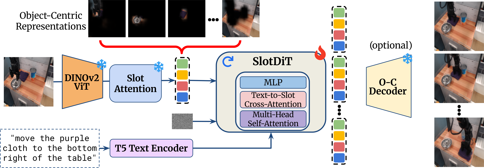
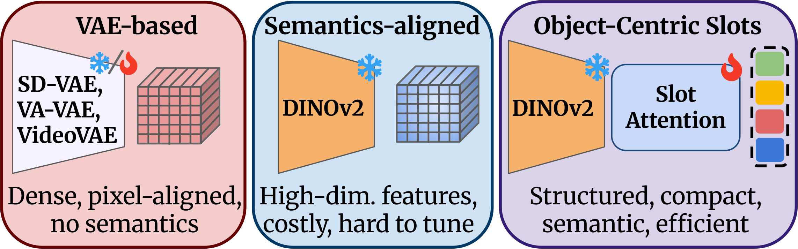
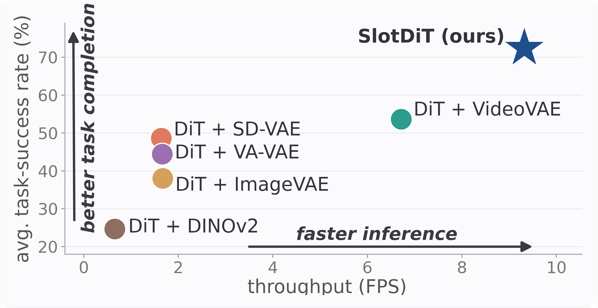

# SlotDiT: Object-Centric Representations for Diffusion Transformers

Official implementation of *SlotDiT: Object-Centric Representations for Diffusion
Transformers* by [Gjergj Plepi](https://www.linkedin.com/in/gjergj-plepi-928a4b196/)
and [Sven Behnke](https://www.ais.uni-bonn.de/behnke/). BMVC 2026.

[[`Project Page`](https://slot-dit.github.io/)]

<table>
  <tr>
    <td colspan="2" align="center">
      <b>(a) Object-Centric Representations</b><br>
      
    </td>
  </tr>
  <tr>
    <td width="62%" align="center">
      <b>(b) Same DiT, different latent representations</b><br>
      
    </td>
    <td width="38%" align="center">
      <b>(c) Efficiency vs. task success</b><br>
      
    </td>
  </tr>
</table>

SlotDiT is a text-guided Diffusion Transformer that predicts future scene dynamics
in a compact object-centric slot space. Given one reference image and a language
instruction, it autoregressively denoises future slot trajectories, which can be
decoded into video frames or used for robot control.

## Installation

Clone the repository and install the dependencies in a Python 3.9+ environment:

```bash
git clone https://github.com/Gjergj121/SlotDiT.git
cd SlotDiT
pip install -r requirements.txt
```

Use the PyTorch build appropriate for your CUDA installation. Training requires a
CUDA-capable GPU. `xformers` is optional; PyTorch scaled-dot-product attention is
used when it is unavailable.

## Data and configuration

The repository includes example experiment configs in `src/configs`, grouped by
dataset and representation. Set `dataset.root` and the paths in `representation`
before running an experiment. `dataset.root` selects the prepared dataset directory.
`representation` specifies the representation type and the information required to load it, such as architecture config, pretrained checkpoint, etc.

The loaders expect the following data layouts:

| Dataset | Expected layout below `dataset.root` |
|---|---|
| [CLIPort](https://github.com/cliport/cliport) | `train/episode*/color/*_color.png` and `task_description.txt`; the same under `val/` |
| [Language Table](https://github.com/google-research/language-table) (synthetic) | `train/<episode>/*.png`, `val/<episode>/*.png`, and `labels/<episode>.npy`; `actions/<episode>.npy` is needed for inverse dynamics |
| Language Table (real) | `metadata.json` and episode `.pt` files containing `images` (uint8 TCHW) and `instruction` |
| [BridgeData V2](https://rail-berkeley.github.io/bridgedata/) | `train/episode*/color/*` and `task_description.txt`; the same under `val/`, plus the caption-canonicalization JSON named in the config |

The checkpoint entries in the example configs are
only placeholders, as the pretrained checkpoints are not included in this release.

Each dataset directory provides configs for SlotDiT and the DiT + SD-VAE, ImageVAE,
VideoVAE, VA-VAE, and DINOv2/RAE baselines. For ImageVAE and VideoVAE, set `representation.config` 
to a corresponding architecture when using either baseline. VA-VAE and DINOv2/RAE also 
require their normalization statistics and decoder checkpoints. T5-small, DINOv2, and SD-VAE weights 
are loaded from Hugging Face.

## Training

First create and train an object-centric decomposition experiment:

```bash
python src/01_create_experiment.py \
  --config src/configs/cliport/slotdit.json \
  -d experiments/cliport_decomposition

python src/02_train_dinosaur.py -d experiments/cliport_decomposition
```

Set `representation.checkpoint` in the SlotDiT config to the trained DINOSAUR
checkpoint, then create and train the predictor experiment:

```bash
python src/01_create_experiment.py \
  --config src/configs/cliport/slotdit.json \
  -d experiments/cliport_slotdit

python src/04_train_predictor.py -d experiments/cliport_slotdit
```

Use the same predictor command with one of the baseline configs. Shared defaults
are defined in `src/CONFIG.py` and are merged with the selected
`experiment_params.json`. Both training entry points also support distributed
execution with `torchrun`, for example:

```bash
torchrun --standalone --nproc_per_node=2 \
  src/04_train_predictor.py -d experiments/cliport_slotdit
```

To resume predictor training, pass the saved checkpoint explicitly:

```bash
python src/04_train_predictor.py \
  -d experiments/cliport_slotdit \
  --resume-training \
  --checkpoint experiments/cliport_slotdit/models/checkpoint_last_saved.pth
```

The inverse dynamics model training is supported for CLIPort and LanguageTable Synthetic:

```bash
python src/04_train_idm.py \
  --config src/configs/cliport/slotdit.json \
  -d experiments/cliport_idm
```

## Evaluation

Evaluate a predictor checkpoint on the validation split with:

```bash
python src/05_evaluate_predictor.py \
  -d experiments/cliport_slotdit \
  --checkpoint experiments/cliport_slotdit/models/checkpoint_last_saved.pth \
  --num-preds 29 \
  --metrics lpips psnr ssim \
  --output results/cliport_slotdit.json
```

The paper configuration uses one observed frame, four history frames, 50 DDIM
sampling steps, and classifier-free guidance of 1.5. Add `fvd` to `--metrics` and
provide `--i3d-checkpoint` to compute FVD.

Optional VLM task-success evaluation is enabled with `--vlm-model` and `--vlm-url`
for an OpenAI-compatible vision endpoint. Install `openai` separately and set
`OPENAI_API_KEY` when required by the endpoint.

## Maintainer

This repository is maintained by
[Gjergj Plepi](https://www.linkedin.com/in/gjergj-plepi-928a4b196/).

For questions about the project or repository, please contact the maintainer at
[plepi@ais.uni-bonn.de](mailto:plepi@ais.uni-bonn.de).

## Acknowledgments

The repository follows the experiment organization of
[TextOCVP](https://github.com/angelvillar96/TextOCVP) and builds on open-source
implementations including [DiT](https://github.com/facebookresearch/DiT) and
[diffusion-forcing-transformer](https://github.com/kwsong0113/diffusion-forcing-transformer).

## Citation

```bibtex
@inproceedings{plepi2026slotdit,
  title     = {SlotDiT: Object-Centric Representations for Diffusion Transformers},
  author    = {Plepi, Gjergj and Behnke, Sven},
  booktitle = {British Machine Vision Conference (BMVC)},
  year      = {2026}
}
```

## License

This project is released under the [MIT License](LICENSE).
